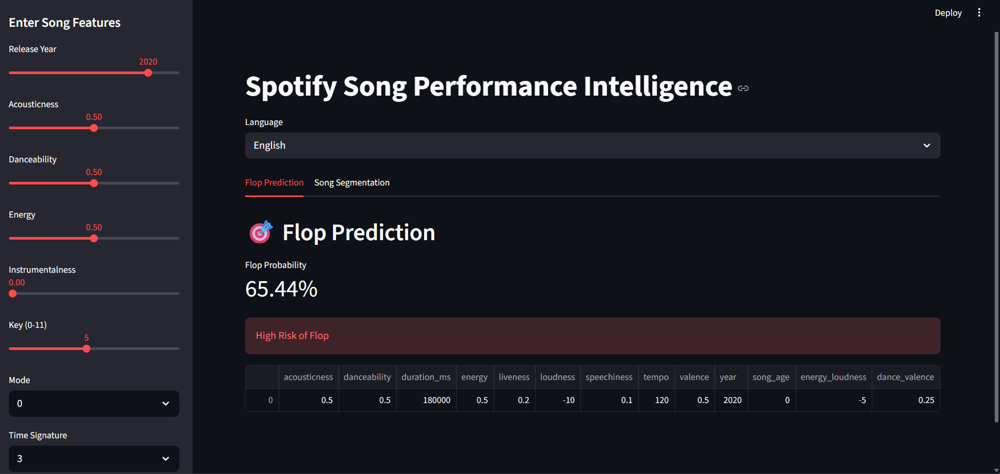
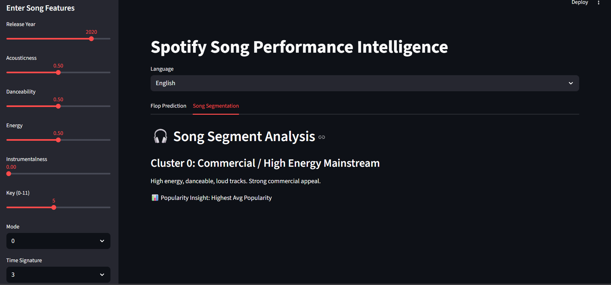
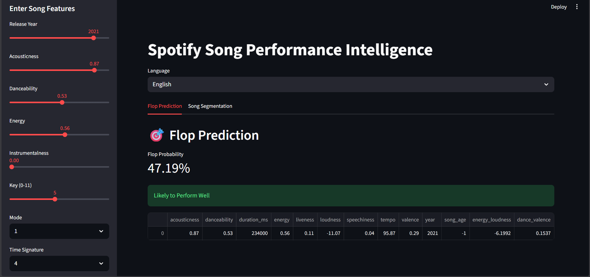
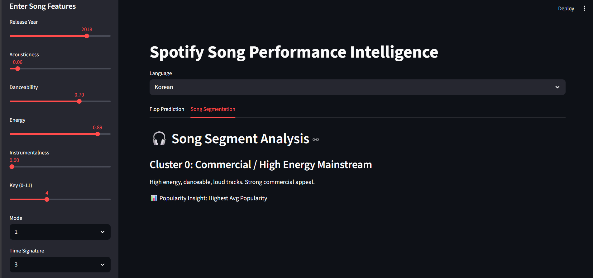

# 🎵 Spotify Song Performance Intelligence

An end-to-end Machine Learning project that predicts whether a song is likely to **flop** and segments songs into musical categories using clustering.

---

## Built With

- Scikit-learn  
- Random Forest  
- KMeans Clustering  
- PCA (Principal Component Analysis)  
- Streamlit  

---

## Project Overview

This project performs two major tasks:

---

### 1. Flop Prediction (Supervised Learning)

Predicts whether a song is likely to be a flop based on its audio features.

**Techniques Used:**
- Feature Engineering  
- Standard Scaling  
- Binary Classification  

**Target Variable:**

```
flop_class = 1 if popularity < 20 else 0
```

---

### 2. Song Segmentation (Unsupervised Learning)

Segments songs into meaningful musical categories using:

- Feature Engineering  
- Standard Scaling  
- PCA  
- KMeans Clustering  

**Identified Musical Segments:**
-  High Energy Commercial  
-  Acoustic / Emotional  
-  Speech / Niche  

##  Machine Learning Pipeline

---

###  Classification Model

**Algorithm:** RandomForestClassifier  

**Techniques Used:**
- Class imbalance handled using `class_weight="balanced"`
- Hyperparameter tuning with `GridSearchCV`
- Evaluation metric: **ROC-AUC**

####  Preprocessing
- StandardScaler for numerical features  
- OneHotEncoder for categorical feature (language)  
- ColumnTransformer integrated within a Pipeline  

---

###  Model Performance (Classification)

```
              precision    recall  f1-score   support

           0       0.66      0.55      0.60      4012
           1       0.80      0.86      0.83      8452

    accuracy                           0.76     12464
   macro avg       0.73      0.71      0.72     12464
weighted avg       0.76      0.76      0.76     12464
```

**Test ROC-AUC Score:** `0.806`

---

### Clustering Model

**Techniques Used:**
- StandardScaler  
- PCA (Dimensionality Reduction)  
- KMeans Clustering  

### Model Performance (Clustering)

- **Optimal K Selected:** 3  
##  Song Segmentation (Clustering Insights)
Songs were segmented into 3 clusters using PCA + KMeans:

### Cluster 0 – Commercial / High Energy
**Popularity:** Highest  
High energy, danceable, loud tracks with strong mainstream appeal.

###  Cluster 1 – Acoustic / Emotional
**Popularity:** Medium  
More acoustic and softer tracks, often emotional or indie in style.

###  Cluster 2 – Speech / Niche
**Popularity:** Very Low  
High speech content, spoken-word or niche tracks with higher flop risk.

### Song Segmentation


Streamlit App
=============

The project includes a fully deployed ML interface using Streamlit.

Tabs:
Flop Prediction,
Song Segmentation

Users can input:
Audio features,
Musical attributes,
Language,
Year

And instantly get:
Flop probability,
Risk classification,
Cluster category + interpretation

Output
======
###  Flop Risk: High

<p align="center">
  
</p>

<p align="center">
  
</p>

###  Likely To Perform Well:
<p align="center">
  
</p>

<p align="center">
  
</p>

<p align="center">
  
</p>
<p align="center">
  
</p>


